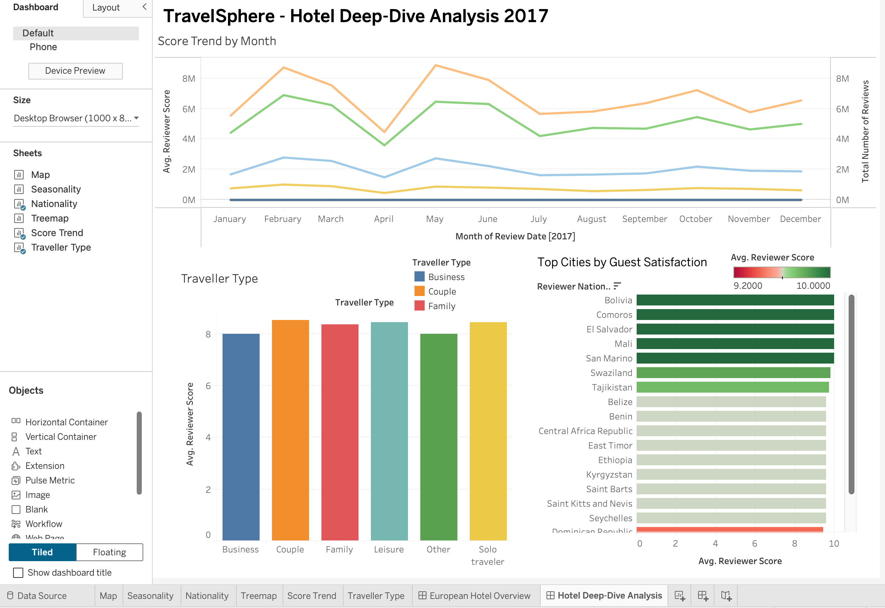
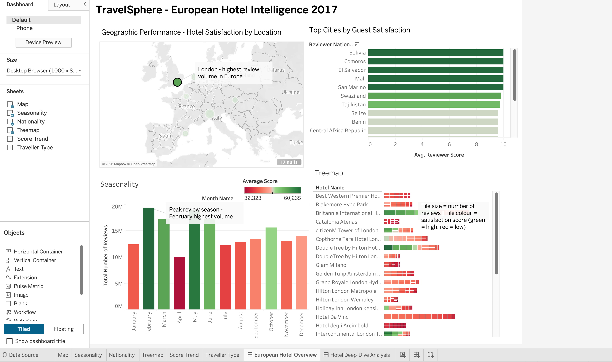

# TravelSphere European Hotel Intelligence Dashboard

An interactive Tableau BI solution analysing 64,751 European hotel reviews to help a travel agency select the best hotel partners for their portfolio.

## Overview

TravelSphere is a luxury travel agency refining its portfolio of partner hotels across Europe. This project processes and visualises 2017 customer review data to answer four key business questions for the Head of Customer Experience:
- **Geographic Performance** — which cities/locations yield the highest satisfaction?
- **Nationality Bias** — do certain reviewer nationalities score more harshly or generously?
- **Sentiment Drivers** — what themes drive positive vs. negative reviews?
- **Seasonality** — how does review volume and satisfaction shift throughout the year?

## Dashboards

**Dashboard 1 — European Hotel Overview** (strategic view)

**Dashboard 2 — Hotel Deep-Dive Analysis** (tactical, hotel-level view)

## Key Insights

- **London dominates** both review volume and satisfaction scores, with secondary strong performers in Amsterdam and Vienna
- **February and May are peak review months**, useful for TravelSphere to anticipate seasonal demand
- **Reviewer nationality noticeably affects scoring patterns** — some nationalities score more generously than others, which matters when interpreting a hotel's "true" quality
- Traveller type (Business, Couple, Family, Leisure, Solo) reveals which hotels perform consistently across segments vs. specialise in one type of guest

## How It Was Built

- **Data cleaning**: Removed 58 duplicate rows in Excel, filtered dataset to 2017 records only, validated field types (dates, geographic roles for mapping)
- **Calculated fields in Tableau**: Month Name/Number for correct sorting, Score Tier bucketing, Traveller Type extraction from a compound tags field
- **Visualisations**: Symbol map (geographic performance), monthly seasonality bar chart, nationality ranking chart, hotel treemap, score trend line chart — using a consistent red-green colour scale and interactive filter actions across all charts
- **Tools**: Tableau Desktop, Microsoft Excel

## Files in This Repo

- `Areej_A2_BI-2 (2).twbx` — full interactive Tableau workbook (open in Tableau Desktop or [Tableau Public/Reader](https://www.tableau.com/products/reader))
- `Areej_A2_BI_Final-1 (4).pdf` — full written report with detailed methodology, use cases, and design rationale

*Built as part of my Master of Business Analytics coursework at RMIT University (2026).*
